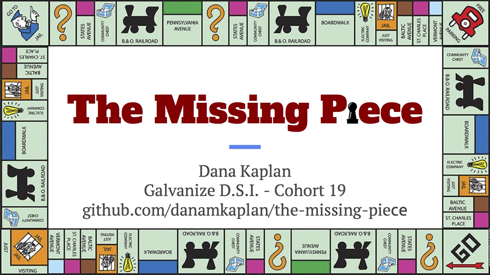

# The Missing Piece
A recommender system built with [BoardGameGeek's](https://www.boardgamegeek.com/) data. This project was built to solve a problem of two initially juxtaposed needs based on your BGG collection:

* Recommend a board game that helps 

### Todo:
 * Finish up the [recommender](./recommender.py) script to actually automate the  recommendation work (profiling a user, calculating the cosine distances. 

