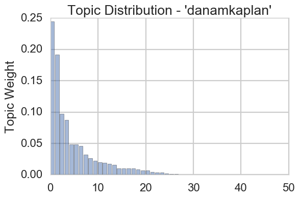

# The Missing Piece
A recommender system built with [BoardGameGeek's](https://www.boardgamegeek.com/) data. This project was built to solve a problem of two seemingly juxtaposed needs based on your BGG collection: Recommending a game that

* You will like, based on the features of your current collection.

* Also addresses needs you don't have covered (such as mechanics, themes, complexity, and player counts) so you have a "robust" collection.

### Idea:

From my interest and experience in the board game space, I know that people tend to conceptualize and discuss games in the language of features. E.g.
	
 * [Thunderstone](https://www.boardgamegeek.com/boardgame/53953/thunderstone) is a **deckbuilder** that has elements of **fantasy**, **hand management**, and **fighting**. 
 * There are a lot of popular **[worker placement](https://www.boardgamegeek.com/boardgamemechanic/2082/worker-placement)** games, but there is a strong connection between the themes of **farming** and **civilization building** to this mechanic.  

	

### Method:
Given my assumptions above, I decided to utilize topic modeling, specifically Non-Negative Matrix Factorization (NMF), to unearth the relationships between the game features. While it initially sounds like a clustering problem, there is a good amount of interplay between 'feature clusters'.

NMF was chosen because it can do 4 very important things in this project:

1. **Find latent features of the topics:**
	* NMF has very interpretable results. After finding an appropriate k (47 in this case), I could get the topic "weights" for both individual games and individual features. 
	* For example, you can see in the top 5 feature weights for Topic #18, there is a strong hinting at "Yahtzee" style games. 

  

| Weight of Feature to Topic | Feature | 
|--------------------|------------|
|0.9441 | 'Dice Rolling' |
|0.0230| 'Press Your Luck'|
|0.0095 |'Paper-and-Pencil'|
|0.0087| 'Betting/Wagering'|
|0.0039| 'Trading'|

2. **Create a topic distribution profile for a user's collection:**

You can see from my 
3. **Cluster each game into the topic that has the heighest weight in it**
4. **This helps in calculating distances by reducing dimenions (in this case 135 to 47).**

### Recommendation Algorithm:
While [BGG's API](https://boardgamegeek.com/wiki/page/BGG_XML_API2) is fantastic at getting information for single games, they highly discourage iterating through user data. Without a large collection of user data, I had to build an item based recommendation system, rather than a user-item system, such as Collaborative Filtering. 

Therefore, I used a heuristic style method to create game recommendations based on a user's BGG profile. 

1. Create a ‘User Topic Profile’
	1. Get topic weights from their game collection. 
2. Explore other clusters.
	1. Filter out all games from the clusters in a user's top 5 topics. 
	2. There should only be games left that would fatten the topic distribution  tail. 
3. Rank within each on Cosine Similarity.
	1. Average the reduced features in the user's current collection, to get their "preference" vector. 
	2. Rank all other games by cosine similarity to that vector.
4. Return the top in each cluster.
	1. Get the highest ranked game from each other cluster.
5. Suggest those games in rank order.

Please see my [slides](https://docs.google.com/presentation/d/1wh3uoLVW908JVUlJ3kaFwRpVqDeuO30AXBN1Fv6vynM) for further details. 

### Future Work:
 * Finish up the [recommender](./recommender.py) script to actually automate the  recommendation work (profiling a user, calculating the cosine distances, ranking games,etc...)
 * Replace the collection of json files as an actual DB, to help protect against future headaches. 
 * Make entire project into a Flask app
 	* Add a 'blacklist' type feature to exclude a mechanic or topic completely. E.g. I simply don't like to play or own heavy **negotiation** and **political** type games. Even if it is a topic I am weak in, I simply won't add those games to my collection. 
 * Address the model, and specifically adjust and add relevant features, as I test this recommender in the real world. 

